# Spatial Transcriptomics — 10x Genomics Spatial Methods

> **Course:** Special Topics in Bioinformatics
> **Student:** Nawal Babar
> **Due Date:** 26th April 2026
> **Tools:** Python · Scanpy · Squidpy · Google Colab

[](https://python.org)
[](https://scanpy.readthedocs.io/)
[](https://squidpy.readthedocs.io/)

---

## What Is Spatial Transcriptomics?

Traditional RNA sequencing tells you *which* genes are expressed in a tissue, but loses all information about *where* those cells were located. **Spatial transcriptomics** solves this by combining gene expression profiling with physical tissue coordinates — you get both the molecular data and a map of exactly where each cell or spot sits in the tissue.

This assignment explores two major 10x Genomics spatial platforms:

| Platform | Resolution | Description |
|----------|-----------|-------------|
| **Visium** | ~55 µm spots (~10 cells/spot) | Whole-transcriptome capture on a barcoded slide, paired with tissue image (H&E or fluorescence) |
| **Xenium** | Single-cell (~10 µm) | In-situ targeted panel, single-cell resolution with subcellular precision |

---

## Repository Structure

```
spatial-transcriptomics/
│
├── README.md
├── images/
│   ├── t1/   ← Tutorial 1 notebook plots (5 images)
│   ├── t2/   ← Tutorial 2 notebook plots (3 images)
│   ├── t3/   ← Tutorial 3 notebook plots (4 images)
│   └── t4/   ← Tutorial 4 notebook plots (5 images)
│
├── 1_Basic Scanpy spatial analysis/
│   ├── README_T1.md
│   ├── Tutorial1_Basic_Scanpy_Spatial-2.ipynb
│   ├── QC_Plots.png
│   ├── UMAP Plot (transcriptional similarity).png
│   ├── spatial plot_1.png
│   ├── spatial plot_2.png
│   └── rank_genes_groups_heatmap.png
│
├── 2_Visium Fluorescence data/
│   ├── README_T2.md
│   ├── Tutorial2_Visium_Fluorescence-2.ipynb
│   ├── Spacial_scatter_plot.png
│   ├── Spatial Scatter Plot of Clusters.png
│   └── Ripley's Statistics (Spatial Distribution).png
│
├── 3_Visium H&E data/
│   ├── README_T3.md
│   ├── Tutorial3_Visium_HnE-2.ipynb
│   ├── View the H&E Tissue Image.png
│   ├── Visualize Clusters on H&E Image.png
│   ├── spatial_scatter.png
│   └── Neighborhood Enrichment Analysis.png
│
└── 4_Xenium data/
    ├── README_T4.md
    ├── Tutorial4_Xenium-2.ipynb
    ├── spatial_scatter_ Raw Spatial Layout .png
    ├── UMAP of Single Cells.png
    ├── Spatially Variable Genes_1.png
    ├── Spatially Variable Genes_2.png
    └── Neighborhood Enrichment_heatmap.png
```

---

## Tutorial 1 — Basic Scanpy Spatial Analysis

**Library:** `scanpy` | **Dataset:** 10x Visium V1 Mouse Brain Sagittal Posterior

**Key concepts:** QC filtering, normalization, PCA, UMAP, Leiden clustering, spatial gene expression visualisation on tissue image

### Pipeline

```
Load Visium data (sc.read_visium)
    │
    ▼
Quality Control (total counts, genes per spot histograms)
    │
    ▼
Normalize + log1p transform
    │
    ▼
Highly variable gene selection → PCA → Neighbourhood graph → UMAP
    │
    ▼
Leiden clustering
    │
    ▼
Overlay clusters on tissue image
    │
    ▼
Spatially variable gene expression maps (Nrgn, Camk2a)
    │
    ▼
Marker gene heatmap (rank_genes_groups)
```

### Step 1 — Quality Control Histograms

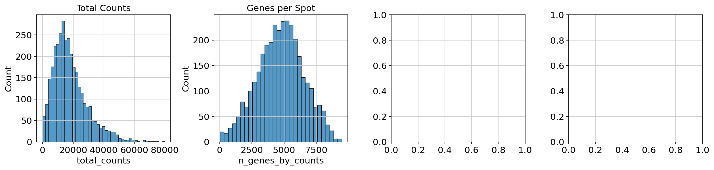

> **Left:** Distribution of total UMI counts per spot. The bell-shaped distribution centred around 10,000–20,000 counts indicates good sequencing depth across most spots. Spots with very low counts (left tail) are filtered out as low-quality.
> **Right:** Distribution of genes detected per spot. Most spots detect 2,500–7,500 genes — expected for Visium data where each spot contains ~10 cells.

### Step 2 — UMAP of Leiden Clusters

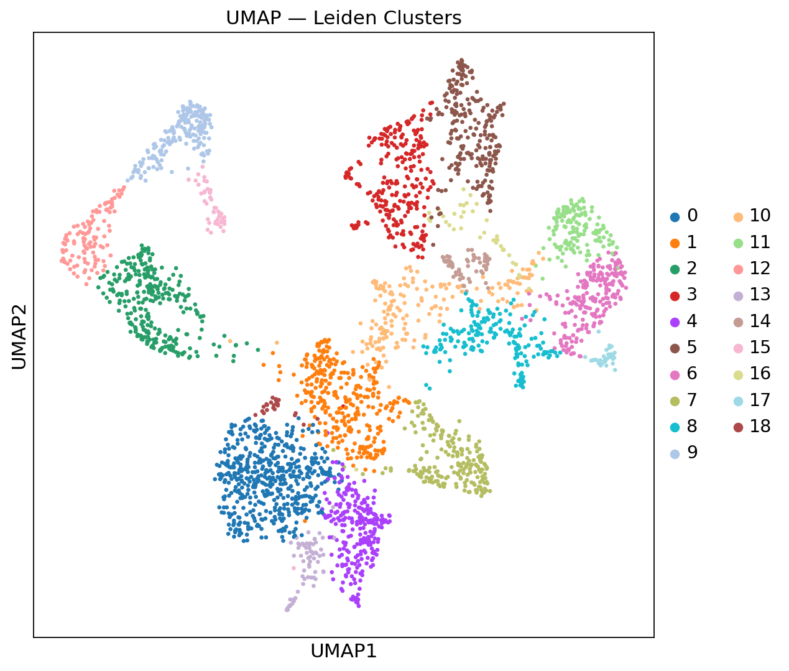

> Each point is one Visium spot. UMAP projects the high-dimensional gene expression space into 2D — spots with similar transcriptional profiles cluster together. 19 distinct Leiden clusters (0–18) are identified, each representing a transcriptionally distinct tissue region or cell type combination.

### Step 3 — Spatial Clusters on Mouse Brain Tissue

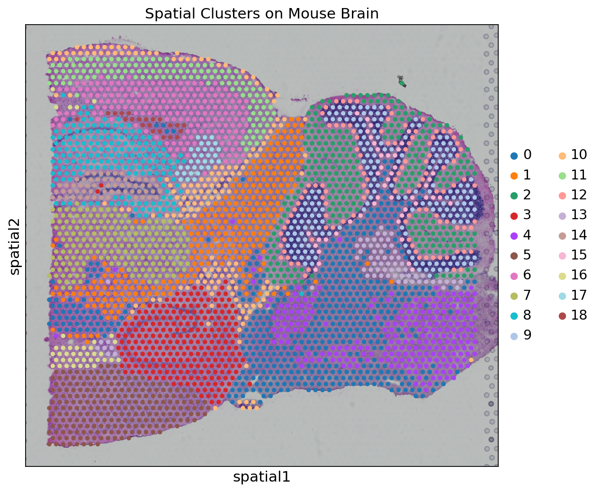

> This is the key output of Visium analysis — Leiden cluster identity overlaid directly onto the physical tissue section. Each coloured dot is a Visium spot at its actual physical location. Spatially coherent regions of the same colour confirm that the clustering has captured real tissue structure — cortex, hippocampus, white matter, and other anatomical regions are visible as distinct colour zones.

### Step 4 — Spatially Variable Gene Expression (Nrgn & Camk2a)

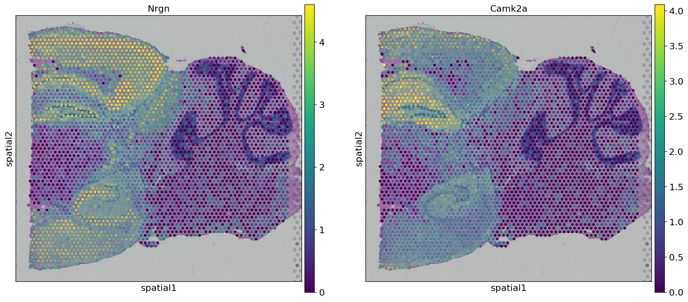

> **Left (Nrgn — Neurogranin):** A neuron-specific protein strongly expressed in the cortex and hippocampus (yellow/green regions). Its spatial pattern perfectly matches the known anatomy of these regions.
> **Right (Camk2a — Calcium/calmodulin-dependent protein kinase II alpha):** A major kinase in excitatory neurons. Co-localises with Nrgn in cortical regions, confirming both genes mark excitatory neuronal spots.

### Step 5 — Marker Gene Heatmap (rank_genes_groups)

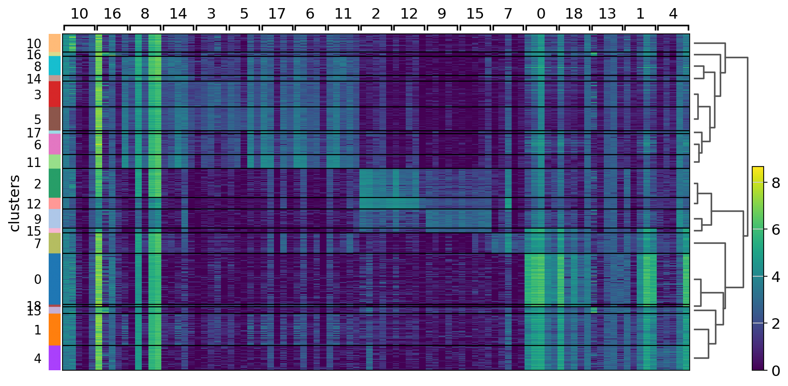

> Hierarchically clustered heatmap of top marker genes across all 19 Leiden clusters. Rows = clusters, columns = genes. Each cluster shows a distinct high-expression signature (bright yellow/green bands), confirming they represent biologically distinct tissue compartments rather than technical noise. The dendrogram on the right groups transcriptionally similar clusters.

📁 [Go to Tutorial 1 →](1_Basic%20Scanpy%20spatial%20analysis/)

---

## Tutorial 2 — Visium Fluorescence Data

**Library:** `squidpy` | **Dataset:** Squidpy built-in fluorescence Visium mouse brain dataset

**Key concepts:** Fluorescence image visualisation, Leiden clustering on fluorescence Visium, Ripley's L statistic for testing spatial clustering

### Pipeline

```
Load fluorescence Visium data (squidpy.datasets)
    │
    ▼
Visualise raw fluorescence image with all spots
    │
    ▼
Normalize + cluster (Leiden)
    │
    ▼
Overlay clusters on fluorescence image
    │
    ▼
Compute Ripley's L statistic per cluster
```

### Step 1 — Raw Fluorescence Image with All Spots

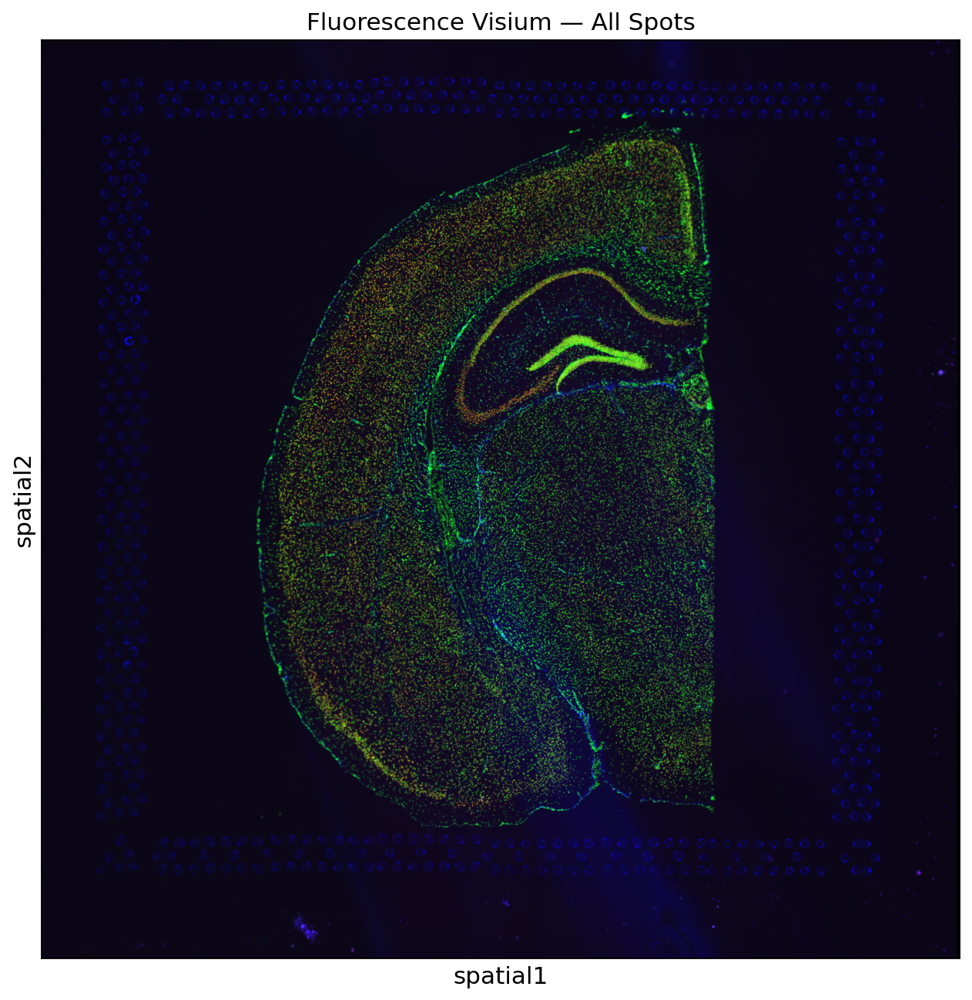

> The raw fluorescence image of the mouse brain coronal section. Unlike H&E, fluorescence imaging labels specific molecular targets — green marks neuronal structures (hippocampal CA regions are clearly visible as bright green arcs), yellow/red marks other cellular components. The grey circles outside the tissue are the alignment fiducials of the Visium slide.

### Step 2 — Leiden Clusters on Fluorescence Image

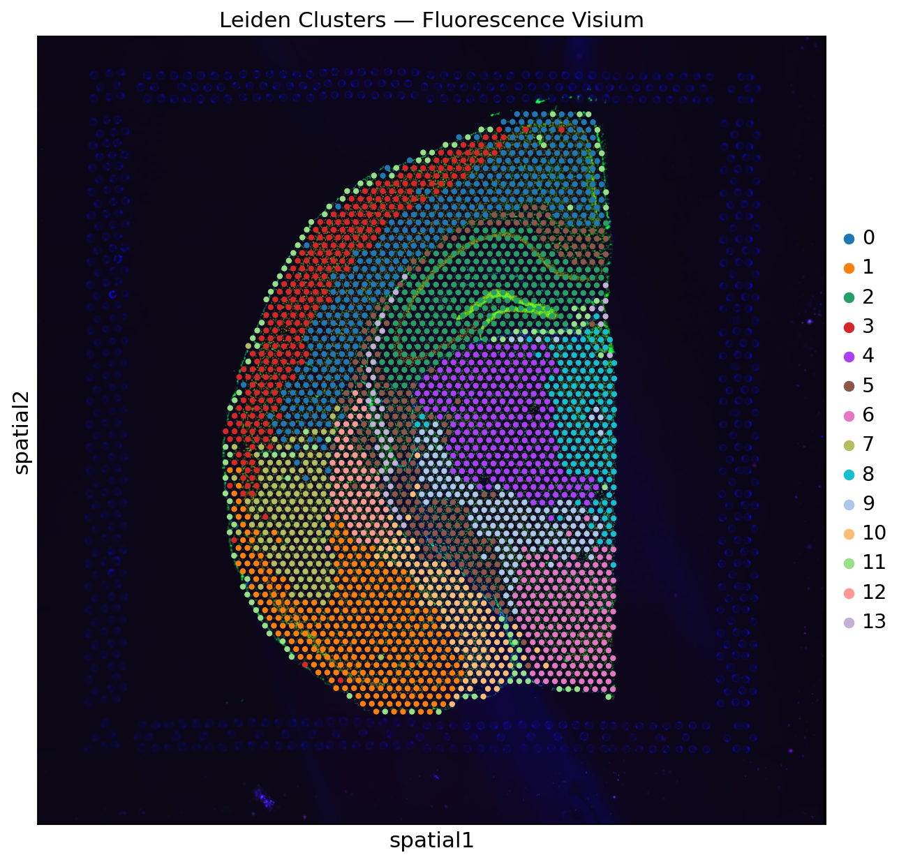

> 14 Leiden clusters overlaid on the fluorescence image. Each spot is coloured by its cluster identity. Anatomical regions are clearly captured — the bright hippocampal structure (visible in the raw image) maps to specific cluster(s), and the cortex, thalamus and other regions form distinct colour zones.

### Step 3 — Ripley's L Statistic

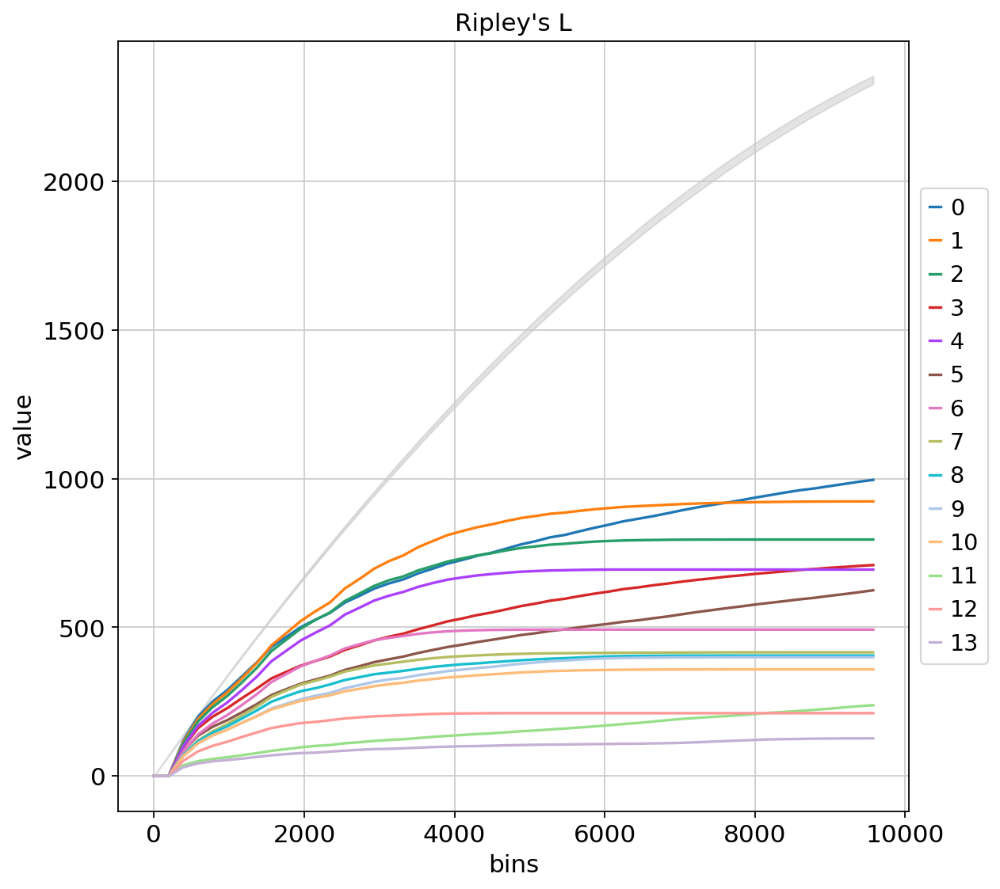

> Ripley's L tests whether each cell type/cluster is more spatially clustered than expected by random chance. **X-axis:** spatial distance (bins). **Y-axis:** Ripley's L value. The grey line = theoretical expectation under complete spatial randomness. All coloured lines (clusters 0–13) fall **above** the null expectation, confirming that every cluster is significantly spatially clustered — cells of the same type physically congregate together in the tissue, as expected for brain anatomy.

📁 [Go to Tutorial 2 →](2_Visium%20Fluorescence%20data/)

---

## Tutorial 3 — Visium H&E Data

**Library:** `squidpy` | **Dataset:** Squidpy built-in H&E Visium mouse brain dataset

**Key concepts:** H&E tissue morphology, Leiden clustering integrated with histology, spatially variable genes (Moran's I), neighborhood enrichment

### Pipeline

```
Load H&E Visium data
    │
    ▼
Visualise raw H&E tissue image
    │
    ▼
QC, normalize, cluster (Leiden)
    │
    ▼
Overlay clusters on H&E image
    │
    ▼
Spatially variable gene maps (Slc17a7, Mbp, Nrgn, Cck)
    │
    ▼
Neighborhood enrichment analysis
```

### Step 1 — Raw H&E Tissue Image

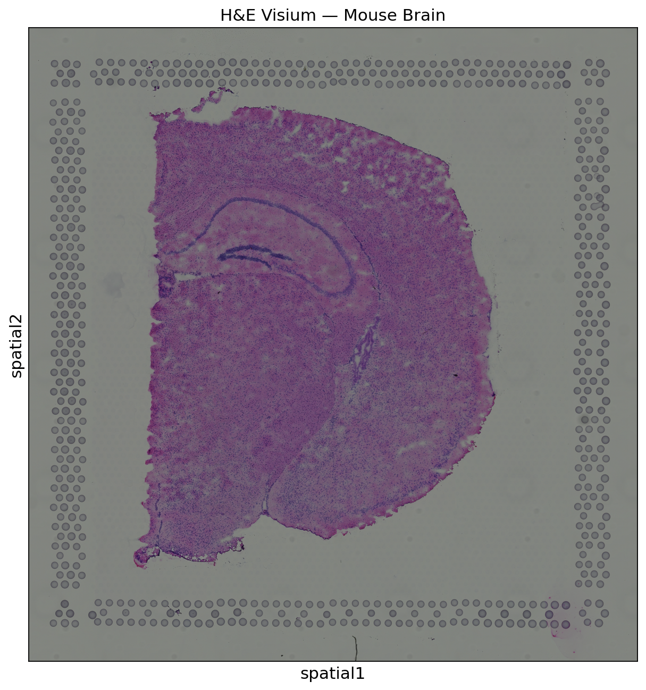

> The raw haematoxylin and eosin (H&E) stained mouse brain section. Haematoxylin stains cell nuclei blue/purple; eosin stains cytoplasm and extracellular matrix pink. The hippocampus is visible as the characteristic curved structure. H&E staining reveals tissue morphology — cell density, layer structure, and tissue compartments — which can be directly compared to transcriptional cluster assignments.

### Step 2 — Leiden Clusters on H&E Image

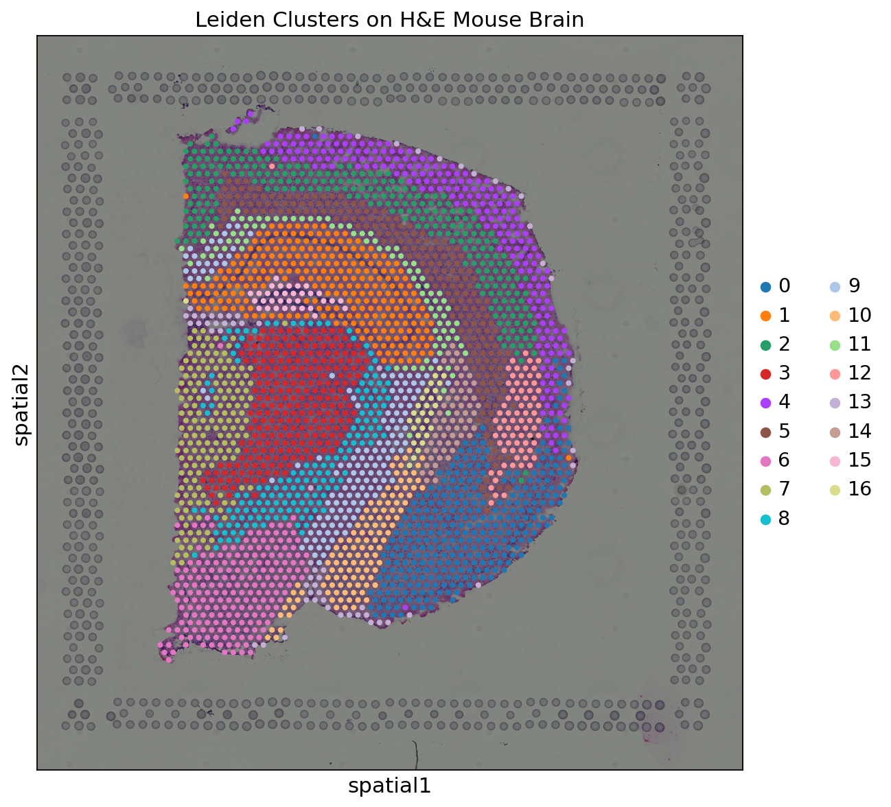

> 17 Leiden clusters overlaid directly on the H&E tissue section. This directly connects transcriptional identity to histological morphology — each coloured region corresponds to a tissue compartment visible in the H&E image. Cortical layers, the hippocampus, white matter tracts (corpus callosum), and subcortical regions are captured as distinct clusters.

### Step 3 — Spatially Variable Gene Expression Maps

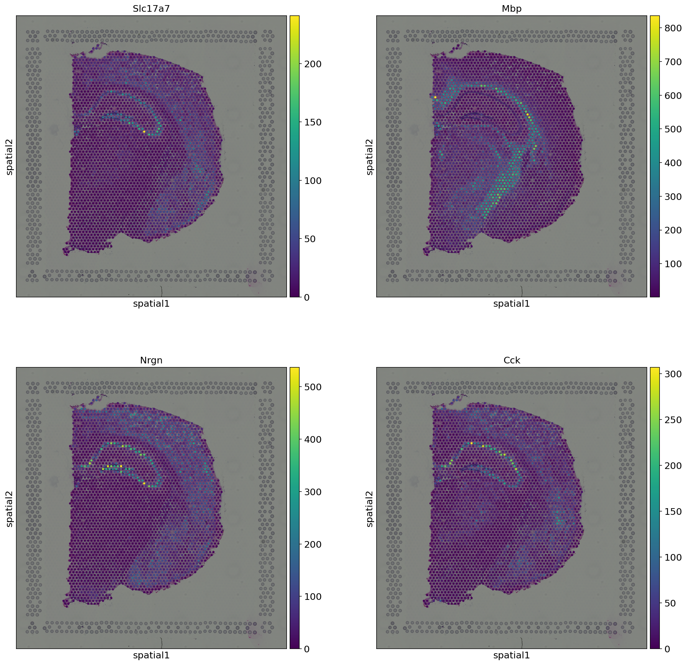

> Four top spatially variable genes (identified by Moran's I autocorrelation) plotted on the tissue:
> - **Slc17a7 (VGluT1):** Glutamatergic neuron marker — expressed in cortex and hippocampal pyramidal layer
> - **Mbp (Myelin Basic Protein):** White matter/oligodendrocyte marker — concentrated in the corpus callosum tract
> - **Nrgn (Neurogranin):** Excitatory neuron marker — cortex and hippocampus
> - **Cck (Cholecystokinin):** Interneuron marker — hippocampal and cortical regions
>
> The spatial restriction of each gene perfectly matches known mouse brain anatomy, validating that Moran's I successfully identifies biologically meaningful spatially variable genes.

### Step 4 — Neighborhood Enrichment Analysis

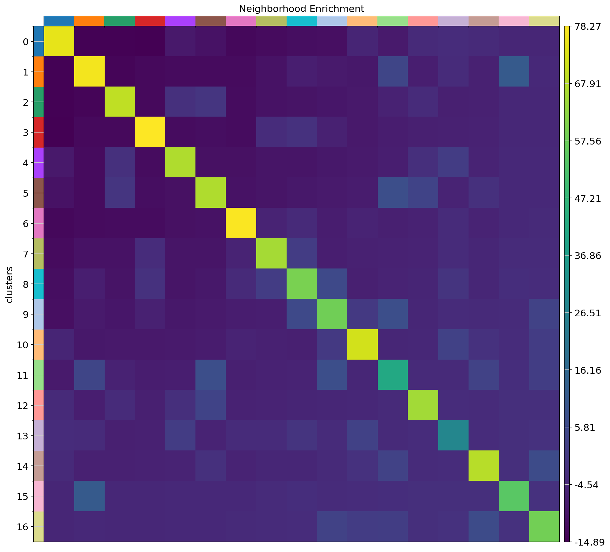

> A symmetric heatmap showing which pairs of clusters are physically co-localised (enriched) or avoid each other (depleted) in the tissue. **Yellow = strongly enriched** (the two clusters are adjacent more often than expected by chance). **Dark purple = depleted** (the clusters avoid each other spatially). The bright diagonal confirms each cluster is most enriched with itself (self-adjacency). Off-diagonal yellow blocks reveal which distinct tissue regions border each other in the brain anatomy — e.g. cortical layer clusters neighbour each other, while cortex and white matter clusters show depletion.

📁 [Go to Tutorial 3 →](3_Visium%20H%26E%20data/)

---

## Tutorial 4 — Xenium Single-Cell Spatial Data

**Library:** `squidpy` | **Dataset:** Squidpy built-in Xenium mouse brain dataset

**Key concepts:** Single-cell resolution spatial analysis (~10 µm per cell), Delaunay triangulation neighbourhood graph, spatially variable genes, neighborhood enrichment at single-cell resolution

Unlike Visium (~10 cells per spot), **Xenium captures individual cells** — each data point is a single cell with precise x/y coordinates.

### Pipeline

```
Load Xenium data (single cells with spatial coordinates)
    │
    ▼
Plot raw spatial layout (all cells, unlabelled)
    │
    ▼
Build Delaunay triangulation neighbourhood graph
    │
    ▼
QC, normalize, PCA, UMAP, Leiden clustering
    │
    ▼
Project clusters back onto spatial coordinates
    │
    ▼
Identify spatially variable genes (ASCT2, ATP5A, CD11c, CD14)
    │
    ▼
Neighborhood enrichment at single-cell resolution
```

### Step 1 — Raw Xenium Spatial Layout (All Single Cells)

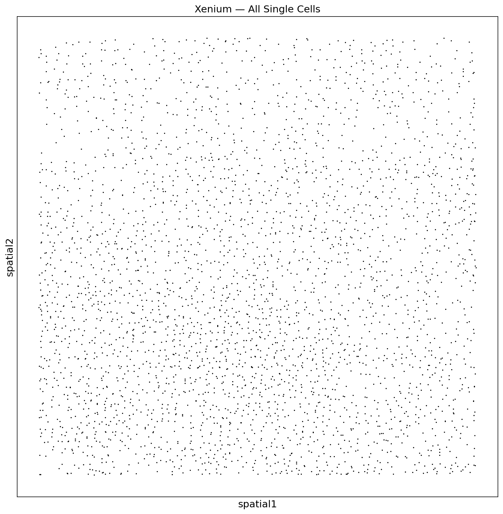

> Each tiny dot is a **single cell** plotted at its exact physical location in the tissue. Unlike Visium spots (~55 µm diameter), Xenium cells are ~10 µm — much higher resolution. The tissue section boundary is visible from the cell distribution pattern. No colour or annotation yet — this is the raw physical map before analysis.

### Step 2 — UMAP of Single Cells

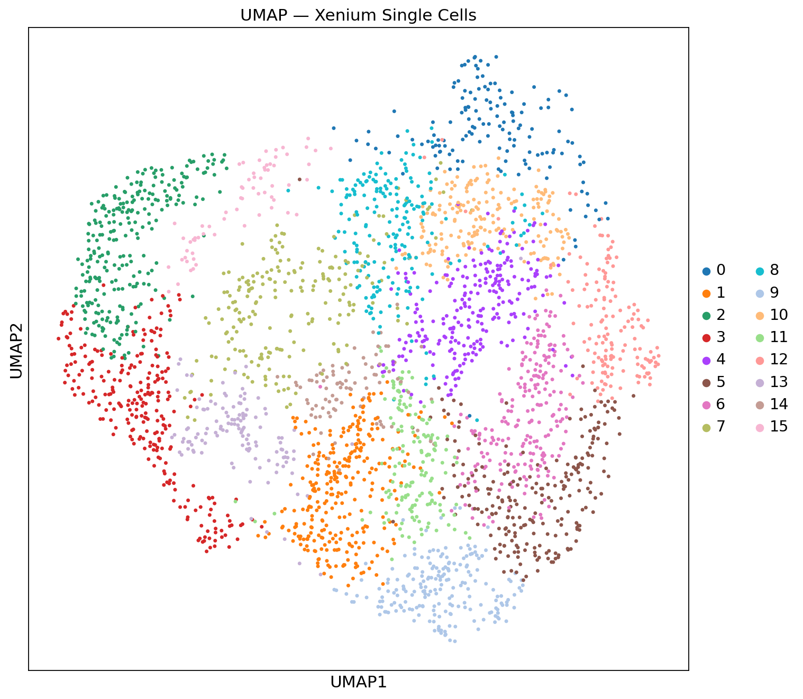

> UMAP of all Xenium single cells coloured by Leiden cluster (0–15). Single-cell resolution reveals finer transcriptional diversity than Visium spot-level data. 16 distinct clusters are identified, each representing a cell type. The smooth, well-separated structure of the UMAP indicates clean clustering without batch effects.

### Step 3 — Single Cell Clusters in Physical Space

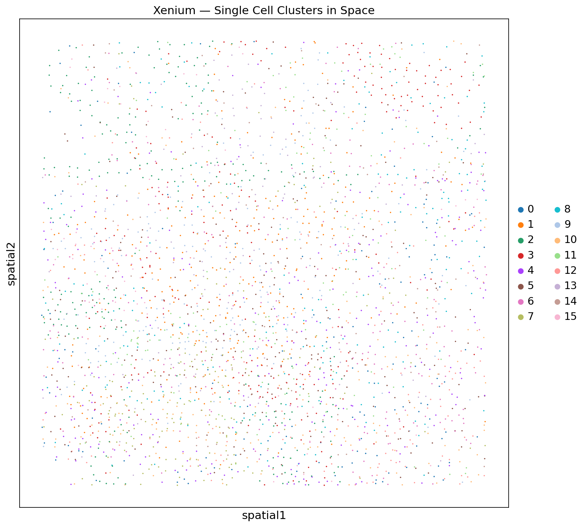

> Leiden cluster colours mapped back onto the physical tissue coordinates. At single-cell resolution, the spatial organisation is more fine-grained than Visium — individual cell layers and microdomains are resolvable. The intermixed appearance of clusters reflects the true cellular heterogeneity within tissue regions that Visium would average together.

### Step 4 — Spatially Variable Genes (Moran's I)

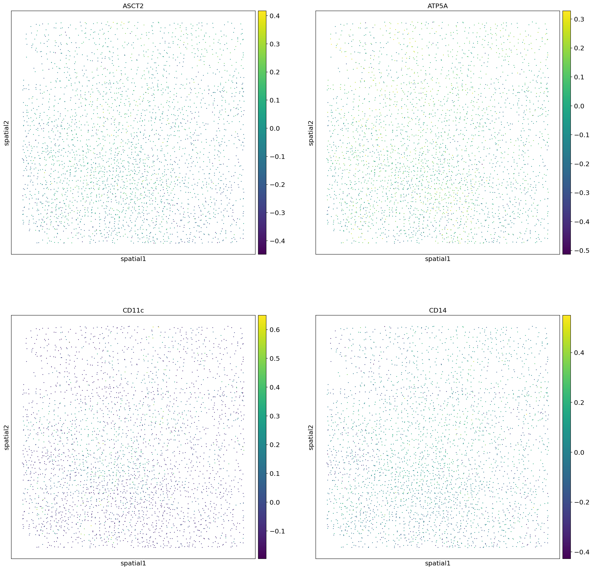

> Top spatially variable genes identified by Moran's I at single-cell resolution:
> - **ASCT2 (SLC1A5):** Glutamine transporter — spatially patterned across the tissue
> - **ATP5A:** Mitochondrial ATP synthase — varies by cell metabolic state across regions
> - **CD11c (ITGAX):** Dendritic cell / microglia marker — spatially restricted immune cells
> - **CD14:** Monocyte/macrophage marker — identifies immune cell niches in the tissue
>
> The colour scale shows Moran's I score (positive = spatially clustered, negative = dispersed). At single-cell resolution, spatial gene patterns are sharper and more precise than Visium.

### Step 5 — Neighborhood Enrichment (Single-Cell Resolution)

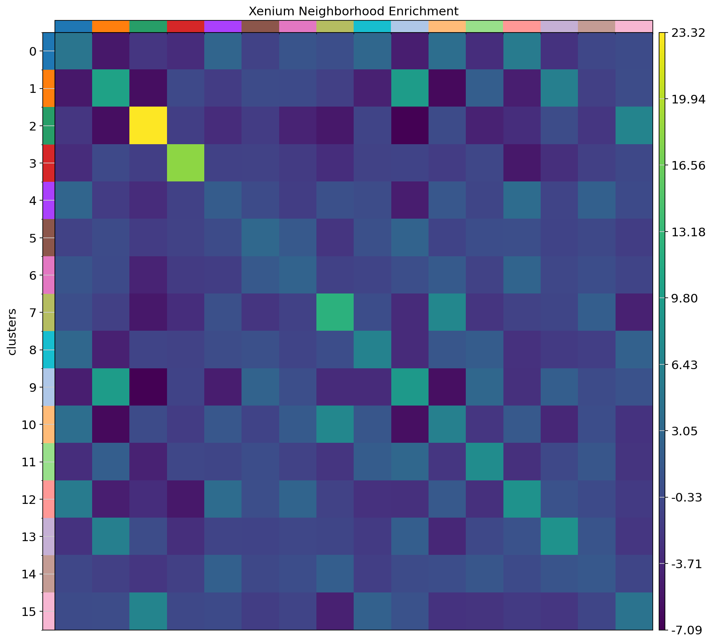

> Neighborhood enrichment at single-cell resolution (16 Xenium clusters). **Yellow = co-localised** (cell types that physically neighbour each other more than chance). **Dark purple = spatially avoiding.** At this resolution, specific cell-type interactions are captured at the individual cell level — for example, the strong enrichment between clusters 2 and 3 (top-left bright yellow block) indicates these two cell types are tightly co-localised, possibly representing an interacting cell pair such as neurons and their supporting glia.

📁 [Go to Tutorial 4 →](4_Xenium%20data/)

---

## Key Biological Concepts Covered

| Concept | Tutorial |
|---------|----------|
| Visium spatial barcoding | T1, T2, T3 |
| QC and normalization | T1, T2, T3, T4 |
| PCA + UMAP | T1, T4 |
| Leiden clustering | T1, T2, T3, T4 |
| Spatial cluster overlay on tissue image | T1, T2, T3, T4 |
| Moran's I spatial autocorrelation | T3, T4 |
| Ripley's L statistic | T2 |
| Neighborhood enrichment | T3, T4 |
| H&E histology integration | T3 |
| Fluorescence image integration | T2 |
| Single-cell resolution (Xenium) | T4 |
| Spatially variable gene identification | T3, T4 |

---

## Environment & Requirements

All notebooks run in **Google Colab** — no local installation required.

```python
# Install in the first cell of any notebook
!pip install scanpy squidpy leidenalg -q
```

| Package | Purpose |
|---------|---------|
| `scanpy ≥ 1.9` | Core single-cell/spatial analysis |
| `squidpy ≥ 1.3` | Spatial omics analysis and visualisation |
| `leidenalg ≥ 0.9` | Leiden community detection |
| `matplotlib ≥ 3.5` | Plotting |

---

## How to Run

1. Click into any tutorial folder
2. Open the `.ipynb` notebook
3. Click **"Open in Colab"**
4. **Runtime → Run all**

---

*Submitted as part of Special Topics in Bioinformatics coursework — Nawal Babar, 2026*
